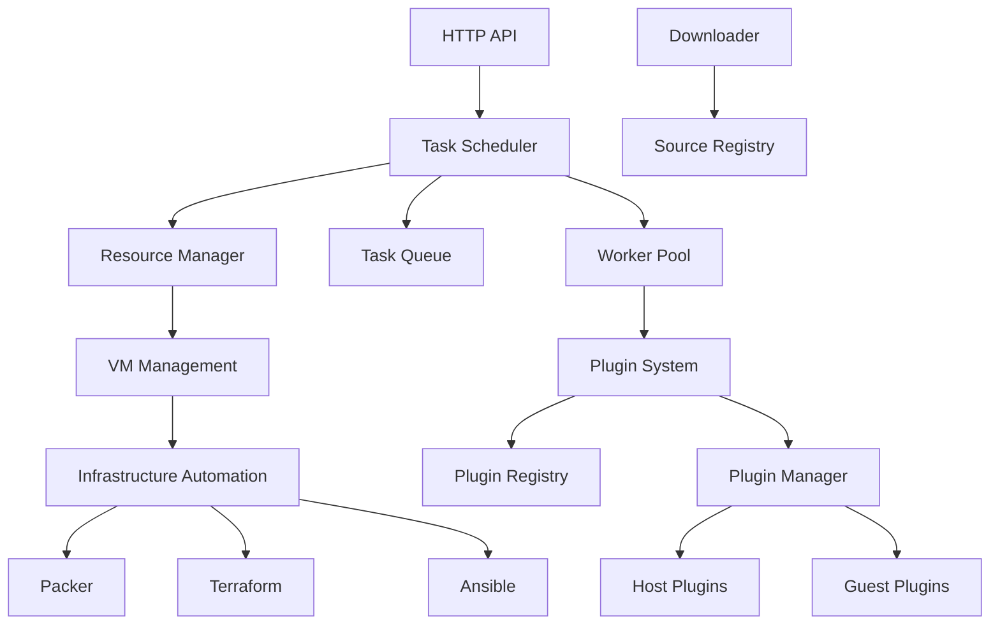
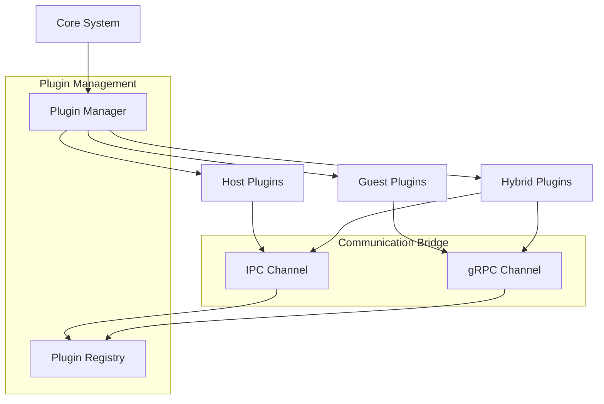
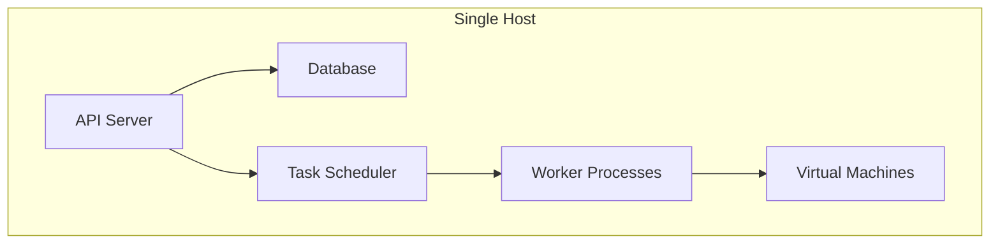
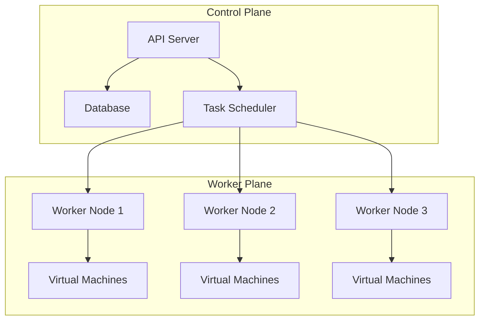
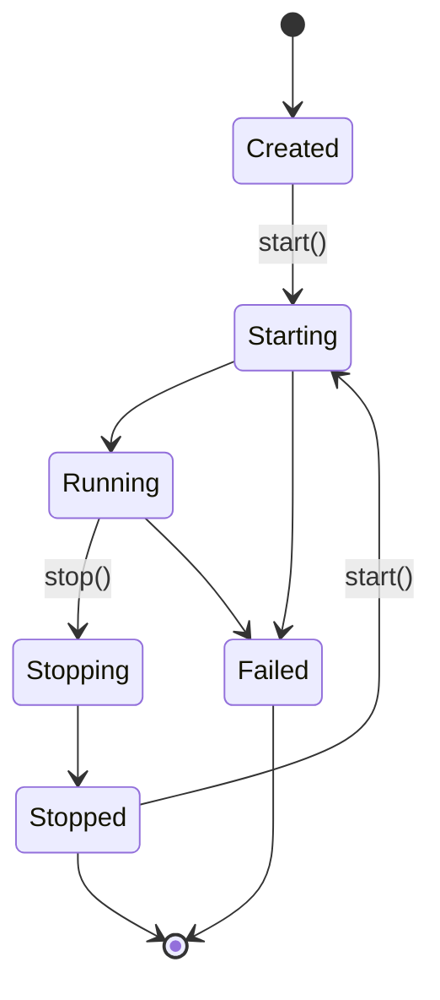

Malbox is designed with a modular, plugin-driven architecture that emphasizes safety, performance, and extensibility. This document provides an overview of the core components and how they interact.

## High-Level Architecture

At its core, Malbox consists of several main components that work together to provide a complete malware analysis platform:

## Core Components

### Task Management System

The task management system is responsible for scheduling, executing, and monitoring malware analysis tasks:

- **Task Scheduler**: Orchestrates the overall analysis process, managing task state transitions and resource allocation.
- **Task Queue**: Prioritizes pending tasks based on their priority and submission time.
- **Worker Pool**: Manages a pool of worker processes that execute analysis tasks.

### Resource Management

The resource management system allocates and manages the virtual machines and infrastructure needed for analysis:

- **Resource Manager**: Tracks available resources and allocates them to tasks as needed.
- **Infrastructure Integration**: Interfaces with Terraform, Packer, and other tools to provision and configure analysis environments.

### Plugin System

The plugin system is the heart of Malbox's extensibility:

- **Plugin Manager**: Manages the lifecycle of all plugins, including loading, initialization, and communication.
- **Plugin Registry**: Maintains a registry of available plugins and their capabilities.
- **IPC System**: Provides efficient zero-copy communication between the core system and plugins using iceoryx2.

### VM Management

Malbox uses virtualization to provide isolated environments for dynamic analysis:

- **VM Provisioning**: Automates the creation and configuration of virtual machines.
- **Image Building**: Creates custom VM images with pre-installed analysis tools.
- **Network Management**: Configures isolated or controlled network environments for analysis.

### Storage System

The storage system manages all the data associated with analysis tasks:

- **Sample Storage**: Securely stores malware samples.
- **Result Storage**: Stores analysis results and artifacts.
- **Configuration Storage**: Manages configurations for the system and plugins.

## Data Flow

The typical data flow for an analysis task follows these steps:

1. A user submits a file for analysis through the API
2. The scheduler adds the task to the queue
3. When resources are available, the scheduler assigns the task to a worker
4. The worker allocates necessary resources (VMs, network, etc.)
5. The worker loads and initializes the required plugins
6. The plugins analyze the sample and generate results
7. Results are collected, processed, and stored
8. Resources are released back to the pool

## Communication

Malbox uses several communication mechanisms:

- **HTTP API**: External communication with clients
- **Inter-Process Communication (IPC)**: High-performance zero-copy communication between the core system and host plugins
- **gRPC**: Communication with guest plugins running inside virtual machines
- **Database**: Persistent storage and state management

## Deployment Architecture

Malbox supports several deployment architectures:

### Single-Node Deployment

All components run on a single machine. Suitable for small-scale installations and testing.

### Distributed Deployment

Components are distributed across multiple machines for scalability. Suitable for large-scale installations.

## Plugin Lifecycle

Plugins in Malbox follow a well-defined lifecycle:

1. **Created**: Plugin instance is created but not started
2. **Starting**: Plugin is initializing resources
3. **Running**: Plugin is actively processing tasks
4. **Stopping**: Plugin is cleaning up resources
5. **Stopped**: Plugin has stopped and can be restarted
6. **Failed**: Plugin encountered an error

## Technology Stack

Malbox is built with a modern, performance-focused technology stack:

| Component | Technology | Purpose |
|-----------|------------|---------|
| Core | Rust | Safety, performance, concurrency |
| Database | PostgreSQL | Reliable state management |
| IPC | iceoryx2 | Zero-copy inter-process communication |
| API | Axum | High-performance web framework |
| Infrastructure | Terraform, Packer, Ansible | Infrastructure automation |
| Virtualization | KVM, VMware, VirtualBox | Isolated analysis environments |

## Next Steps

Now that you understand Malbox's architecture, you might want to explore:

- [Core Concepts](/core-concepts): Deeper dive into Malbox's fundamental concepts
- [Plugin System](/plugins/overview): Learn more about the plugin architecture
- [Infrastructure](/infrastructure/overview): Details on infrastructure management
- [Development Guide](/dev/architecture): Detailed architecture for developers