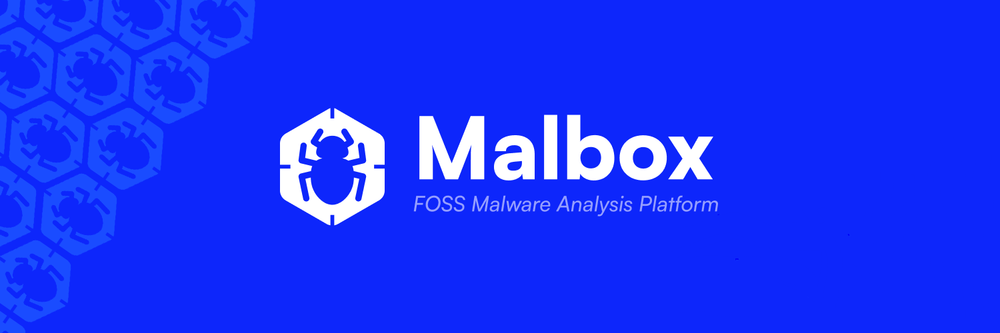

import { Aside } from "@astrojs/starlight/components";

Malbox is an open-source malware analysis platform designed to provide security researchers, malware analysts, and cybersecurity teams with a powerful, extensible environment for analyzing files and understanding their behavior.

<Aside type="note">
  Malbox is still in a very early stage of development, currently, the platform as is, isn't ready to be utilized.
  There are still a considerable amount of rough edges, the code is for the most part not refactored/optimized, all features described
  further-on may not be implemented yet (or only partially) and might change slightly.
</Aside>

## Why Malbox?

The modern threat landscape is evolving rapidly, with attackers constantly developing new techniques to evade detection. Most open-source sandboxing solutions today are limited, impractical, lack optimization, and fall short in features.
  
Malbox tries to bridge this gap by offering a modern, extensible platform built on principles of modularity, reliability, community-driven development, and scalability—designed to keep pace with today’s dynamic threat environment.

- **Plugin Architecture**: Extend functionality easily through plugins, which can be written in Rust, Javascript and Python.

- **Performance**: Malbox does not compromise on performance despite its modular plugin system. It primarily uses iceoryx2, a shared-memory IPC (Inter-Process-Communication) library that enables zero-copy and lock-free communication. In addition, plugin creators and users can declare and configure plugin specifics, often resulting in more optimized runtimes and adaptable use cases.

- **Completely Free and Self-Hostable**: Retain full control over your infrastructure—Malbox will remain open-source and free forever.

- **User-friendly Ecosystem**: Malbox’s built-in marketplace makes it easy to install official and community verified plugins. Installation does not require rebuilding or restarting the Malbox service. Plugins and profiles follow strict standards to ensure a healthy, thriving ecosystem.

- **Cloud or On-Premise Deployment**: Malbox supports both cloud-based and on-premise solutions for your infrastructure and storage needs.

- **Easy Deployment**: Enjoy a user-friendly, minimal-overhead setup that is ready to use within minutes. Malbox emphasizes declarative configuration to reduce complexity and simplify the setup and configuration process.

## Key Features

### Analysis Capabilities

Analysis capabilities depend on the plugins installed, hence, the capabilities will continue to grow as plugins are released, both from the community and maintainers. 
For good measure, you can find a couple of functionalities that will be available through official plugins.

- **File Type Support**:
  - Windows Executables (PE32, PE32+)
  - Linux Executables (ELF)
  - macOS Executables (MachO)
  - Office Documents
  - PDF Files
  - Script Files (JS, VBS, PS1)
  - Archive Files

- **Analysis Features**:
  - Automated unpacking
  - String extraction
  - Entropy analysis
  - Network simulation
  - Memory inspection
  - Behavioral analysis
  - Custom scripting support

### Infrastructure Automation

Malbox includes built-in support for infrastructure automation:

- **Declarative Machinery Management**: Define and manage machinery declaratively using tools like Terraform, Packer and Ansible.
- **Image Creation**: Build tailored VM images through Packer for reproducible environments, or download some from the official mirrors using the CLI!
- **Provider Flexibility**: Supports multiple hypervisors such as KVM, VMware, and VirtualBox—users can wrap any provider via the Malbox API

### Plugin System

The heart of Malbox is its extensible plugin system:

- **Host Plugins**: Run directly on the host OS (e.g. for static analysis, emulation, etc.)
- **Guest Plugins**: Execute within VM environments (e.g. for dynamic analysis)

The plugin system mainly uses IPC mechanisms:

- **Host Communication**: Zero-copy IPC using iceoryx2
- **Guest Communication**: Zero-copy IPC using iceoryx2 for communication within the VM, exposed to a gRPC bridge that communicates back to the host

#### Execution Policies

Plugins can operate in various modes:

- **Exclusive**: Plugin must be executed alone, no other plugins can run
- **Sequential**: Plugin must be executed sequentially, one at a time
- **Parallel**: Plugin can run in parallel with other plugins in the same group
- **Unrestricted**: Plugin has no special execution requirements

#### State Management

Plugins can maintain different levels of persistence:

- **Isolated**: Fresh state for each task (default)
- **Global**: Maintains state between all tasks
- **ContextAware**: Maintains state only across tasks of the same type

## Where to Go Next

- [Quickstart Guide](/getting-started/quickstart): Get Malbox up and running quickly
- [System Architecture](/getting-started/architecture): Understand how Malbox works under the hood
- [Core Concepts](/core-concepts): Learn about the key concepts in Malbox
- [Plugin System](/plugins/overview): Dive deeper into Malbox's plugin architecture

## Community and Support

Malbox is an open-source project with a growing community:

- [GitHub Repository](https://github.com/DualHorizon/malbox): Source code and issue tracking
- [Discord Community](https://discord.gg/7BVnQHRy7h): Get help and connect with other users